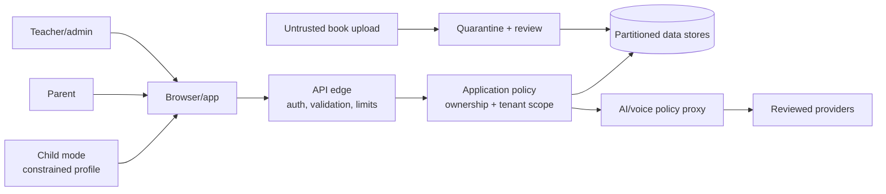

# Threat Model

**Method:** asset and trust-boundary analysis informed by STRIDE and abuse cases

**Scope:** planned family, school, content, AI, and voice services; the current local prototype has a smaller attack surface

## Assets and trust boundaries

Protected assets include adult credentials, parent-child relationships, school memberships, learning evidence, consent records, private content, transient voice data, API/model credentials, audit trails, and content rights.

Every arrow crossing a box is a trust boundary. Browser role claims, object IDs, school IDs, uploads, book text, child text, transcripts, and model output are untrusted.

## Principal threats and controls

| ID | Threat / abuse case | Required controls | Verification |
|---|---|---|---|
| T01 | Object-ID manipulation exposes another child | Server-side relationship authorization; opaque IDs; deny by default | Negative BOLA tests across families |
| T02 | Teacher or admin crosses school boundary | Server-derived tenant; composite tenant keys/RLS; scoped membership | Automated cross-tenant matrix and penetration test |
| T03 | Privilege escalation or silent impersonation | Separate roles, MFA, reauthentication, approved support access, immutable audit | Role-transition and support-access tests |
| T04 | Account takeover/recovery abuse | Passkeys/MFA, secure sessions, throttling, recovery alerts and revocation | Auth threat tests and session review |
| T05 | Child bypasses grown-up gate | Adult session/recent reauthentication for consequential actions | Direct-route, state-tamper, shared-device tests |
| T06 | Child enumeration or public discovery | No public directory; generic errors; rate limits; pseudonymous IDs | Enumeration and error-response tests |
| T07 | XSS or malicious book content | Sanitize/render inert formats; CSP; quarantine; no executable embeds | Upload corpus and browser security tests |
| T08 | Prompt injection leaks data or changes evidence | Treat content/input as data; minimal context; fixed system policy; schema validation; deterministic authority | Adversarial prompt suite |
| T09 | Secret exposed in client, log, or Git | Server secret store, scanning, redaction, rotation | Build inspection and secret scan |
| T10 | Voice provider retains audio or creates biometrics | Explicit adult approval; reviewed contract/config; transient streaming; no storage; typed fallback | Vendor evidence and deletion/traffic test |
| T11 | CSRF, unsafe CORS, replay, or session fixation | SameSite/CSRF token, strict origins, nonce/idempotency, session rotation | Dynamic application tests |
| T12 | Resource abuse or model cost attack | Authentication, quotas, payload/time limits, rate limits, circuit breakers | Load and abuse tests |
| T13 | Dependency/build compromise | Lockfiles, minimal dependencies, provenance, protected CI, review, scanning | SBOM and supply-chain review |
| T14 | Private book piracy or insecure storage | Object authorization, signed URLs, storage deny rules, export logs, watermarking | Storage-policy and expired-link tests |
| T15 | Logs/backups expose child content | Structured minimal logs, redaction, access control, encryption, expiry | Log sampling and backup restore audit |
| T16 | Deletion fails in processor, cache, or backup | Deletion orchestration, tombstones, processor receipts, backup expiry | End-to-end deletion drill |
| T17 | Malicious insider or excessive support access | Least privilege, JIT access, dual approval, audit alerts, sanctions | Quarterly access review and anomaly drill |
| T18 | Shared device reveals reports or changes profiles | Adult gate, short privileged session, child-mode lock, careful local storage, logout/clear controls | Shared-device journey test |
| T19 | Consent is spoofed or becomes stale | Verifiable adult process, versioned receipt, re-consent on material change, withdrawal | Consent lifecycle test |
| T20 | AI produces harmful or false guidance | Bounded use cases, safety tests, fallback, adult review, no high-stakes decisions | Red-team and regression evaluations |

## Misuse cases that remain prohibited

- A school uploads a roster and enrolls children without the required authority.
- A teacher exports unrelated classes “for reporting.”
- A companion asks a child for a secret, address, photo, or private conversation.
- A model provider retains interactions for training.
- Product analytics creates a cross-service child identifier.
- A leaderboard exposes child identity, school, or comparative performance publicly.

## Security acceptance criteria

Launch is blocked by any reproducible cross-family/cross-tenant access, client-side secret, stored raw child audio, unreviewed processor, bypassable adult control, executable upload, missing deletion path, AI authority over achievements, critical/high penetration-test finding, or inability to detect and contain privileged misuse.

Residual risk must name an accountable owner, affected children, likelihood, impact, compensating controls, expiry date, and explicit acceptance by privacy, safeguarding, and security leads. Product schedule alone is not a reason to accept child risk.
